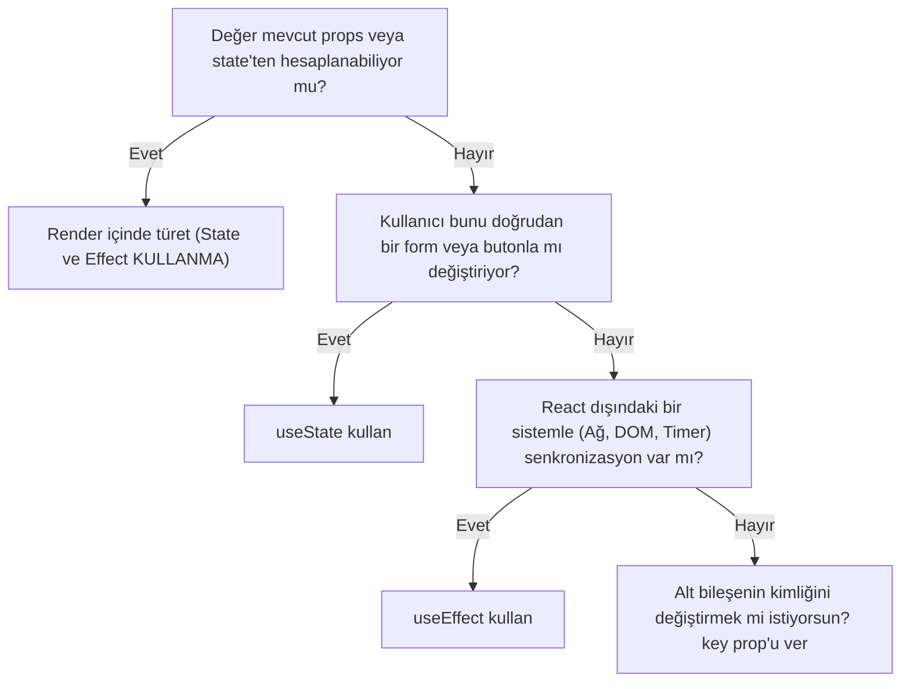

# Her değişim effect istemez

:::pain[Problem]
Kullanıcı film kadro listesinde oyuncu ararken, filtrelenmiş liste bileşende ayrı bir `filteredCast` state'i olarak saklanıyor. Kullanıcı kutudaki metni değiştirdiği render'da ekranda bir an hâlâ eski liste kalıyor; ardından effect tetiklenip state güncelleyince ikinci bir render ile yeni liste geliyor. Bu gecikme arayüzde rahatsız edici bir takılma ve tutarsızlık hissi yaratıyor.
:::

## Effect değil, saf türetme

`useEffect`'in tek bir temel varlık sebebi vardır: **Bileşeni React dışındaki sistemlerle (ağ, DOM, tarayıcı API'leri) senkronize tutmak.**

Eğer bir bilgi elindeki mevcut `props` veya `state` değerlerinden saf bir JavaScript ifadesiyle hesaplanabiliyorsa, o bilgiyi saklamak için asla yeni bir state açmamalı ve bir `useEffect` yazmamalısın. İki state aynı bilginin kopyasını taşıdığında kaçınılmaz olarak senkronizasyon kopar: `props` bir şey söylerken, kopyalanmış `state` bir önceki render'ın değerini fısıldar.

Kurallar:

1. **Önce render içinde hesapla:** Props veya state'ten türetilebilen her değer için ilk tercihin doğrudan render gövdesinde hesaplama yapmak olmalıdır.
2. **Kullanıcı eylemlerini event handler'da tut:** Bir işlem kullanıcının butona tıklaması veya formu göndermesi sonucu gerçekleşiyorsa, o mantık `onClick` veya `onSubmit` içinde çalışmalıdır; effect içinde değil.
3. **Dış sistem yoksa effect'e şüpheyle bak:** Kodunda bir ağ isteği, timer, abonelik veya manuel DOM müdahalesi yoksa, büyük olasılıkla `useEffect` yanlış bir tercihtir.
4. **Yerel state'i sıfırlamak için kimliği (`key`) değiştir:** Farklı bir öğeye geçildiğinde bir alt bileşenin tüm yerel form state'ini sıfırlamak istiyorsan effect ile setter çağırmak yerine `key` prop'u ver.
5. **Erken `useMemo` tuzağına düşme:** Küçük ve orta boyutlu dizileri filtrelemek saniyenin binde biri kadar sürer; ölçüm yapmadan `useMemo` eklemek kodu karmaşıklaştırmaktan başka işe yaramaz.

:::model[Veri akışı]
React'te tek yönlü veri akışı esastır. Props yukarıdan aşağıya akar. Bir değerin tek bir gerçek kaynağı (single source of truth) olmalıdır. Filtrelenmiş liste, orijinal liste ve arama metninin sahibinden hesaplanan anlık bir yansımadır; bağımsız bir veri kaynağı değildir.
:::

## Çift render gecikmesini izleyelim

Diyelim ki elimizde oyuncu listesini filtreleyen bir bileşen var. Ayrı bir state ve effect kullanırsak neler olur?

| An | `query` Prop'u | `filteredCast` State'i | Kullanıcının Gördüğü Ekran | Değerlendirme |
| --- | --- | --- | --- | --- |
| Başlangıç | `""` | `["Bale", "Caine"]` | Bale, Caine | Uyumlu |
| Kullanıcı yazar | `"cai"` | `["Bale", "Caine"]` (Eski) | **Bale, Caine (GECİKME!)** | 1. Render: Arayüz ve prop tutarsız! |
| Effect çalışır | `"cai"` | `setFiltered(["Caine"])` | - | State değişti, 2. render planlandı |
| 2. Render | `"cai"` | `["Caine"]` | Caine | Arayüz nihayet düzeldi |

Bu akışta kullanıcı her tuşa bastığında React gereksiz yere iki kez render çalıştırır ve ilk render'da kullanıcıya eski veriyi gösterir. Çözüm, kopyayı tamamen silip değeri render anında hesaplamaktır.

## Kırık örnek

Aşağıdaki kodda hem gereksiz bir state açılmış, hem de bu state'i senkronize etmek için effect kurulmuştur:

```tsx
import { useEffect, useState } from 'react'

export function CastFilter({ castMembers, query }: { castMembers: string[]; query: string }) {
  // HATA 1: castMembers ve query zaten elimizdeyken ayrı state açmak
  const [visibleMembers, setVisibleMembers] = useState(castMembers)

  // HATA 2: Reaktif değerleri kopyalamak için effect çalıştırmak
  useEffect(() => {
    setVisibleMembers(castMembers.filter((name) => name.includes(query)))
  }, [castMembers, query])

  return (
    <ul>
      {visibleMembers.map((name) => (
        <li key={name}>{name}</li>
      ))}
    </ul>
  )
}
```

Bu bileşende fazladan bir state, fazladan bir effect ve her tuş vuruşunda fazladan bir render vardır.

## Doğru örnek

Gereksiz state ve effect'i atıp değeri doğrudan render anında türetiyoruz:

```tsx check
export function CastFilter({ castMembers, query }: { castMembers: string[]; query: string }) {
  // Doğrudan render anında türetme:
  const normalizedQuery = query.trim().toLocaleLowerCase('tr')
  const visibleMembers = castMembers.filter((name) =>
    name.toLocaleLowerCase('tr').includes(normalizedQuery),
  )

  return (
    <ul>
      {visibleMembers.map((name) => (
        <li key={name}>{name}</li>
      ))}
    </ul>
  )
}
```

Artık `query` değiştiği anda `visibleMembers` aynı render döngüsünde anında yeni değeri alır. Tek bir render yapılır, arayüzde milisaniyelik bir bayatlık dahi yaşanmaz ve kod yarı yarıya kısalır.

Türkçe karakter aramasında `toLocaleLowerCase('tr')` kullanılmasına dikkat et: Türkçedeki `I` ve `İ` harflerinin küçük harf karşılıkları (`ı` ve `i`), İngilizce standart dönüşümde bozulur.

## Key ile yerel state'i sıfırlamak

Bazen hesaplanamayan, gerçekten kullanıcının girdiği yerel bir state vardır. Örneğin kullanıcının belirli bir film için yazdığı inceleme taslağı (`ReviewDraft`).

Kullanıcı film A'dan film B'ye geçtiğinde input kutusundaki taslağın sıfırlanmasını isteriz. Bunu bir `useEffect` ile yapmaya çalışmak sık yapılan bir hatadır:

```tsx
// YANLIŞ YOL:
function ReviewDraft({ movieId }: { movieId: number }) {
  const [text, setText] = useState('')

  useEffect(() => {
    setText('') // Gecikmeli sıfırlama! Önce eski filmde yeni film ID'siyle render olur
  }, [movieId])

  return <textarea value={text} onChange={(e) => setText(e.target.value)} />
}
```

Bu kodda film değiştiğinde bileşen önce eski filmin taslak metniyle render edilir, ardından effect çalışıp metni boşaltır. Bu ara durumda kullanıcı bir önceki filme yazdığı notun yeni filmde göründüğünü fark edebilir.

### Doğru yol: Ağaç ve kimlik (`key`) modeli

React'te bir bileşenin yerel state'i, onun arayüz ağacındaki konumuna ve sahip olduğu `key` değerine bağlıdır.

:::model[Ağaç ve kimlik]
React bileşenin kimliğini `key` ile takip eder. Bir bileşenin `key` değeri değiştiğinde React o bileşeni DOM'dan tamamen kaldırır (unmount) ve sıfırdan yeni bir örnek oluşturur (mount). Bileşenin tüm yerel state'i en doğal şekilde ilk varsayılan değerine döner.
:::

Doğru tasarım şöyle kurulur:

```tsx check
import { useState } from 'react'

export function MovieReviewSection({ movieId }: { movieId: number }) {
  // key={movieId} vererek her film değişiminde ReviewForm'u sıfırdan kuruyoruz:
  return <ReviewForm key={movieId} movieId={movieId} />
}

function ReviewForm({ movieId }: { movieId: number }) {
  const [comment, setComment] = useState('')

  return (
    <div>
      <h4>Film #{movieId} İncelemesi</h4>
      <textarea
        aria-label="Yorum yaz"
        value={comment}
        onChange={(event) => setComment(event.target.value)}
      />
    </div>
  )
}
```

`MovieReviewSection` bileşeninde `ReviewForm`'a `key={movieId}` verildiğinde, `movieId` değiştiği an React eski formu imha eder ve yeni film için tertemiz, boş state'li yeni bir form başlatır. Hiçbir effect yazmadan, sıfır gecikmeyle mükemmel bir sıfırlama elde edilir.

## Event handler mı, effect mi?

Bir eylemin nereye yazılacağına karar verirken şu temel soruyu sor: **"Bu kod kullanıcı belirli bir eylem yaptığı için mi çalışmalı, yoksa bileşen ekranda bu durumda olduğu için mi?"**

| Olay / Durum | Doğru Yer | Neden? |
| --- | --- | --- |
| Kullanıcı "Sepete Ekle" butonuna bastı | `onClick` handler | Butona basılma niyetini taşır |
| Form "Gönder" butonuna basıldı | `onSubmit` handler | Kullanıcı etkileşiminin sonucudur |
| Kullanıcı belirli bir URL'ye girdi ve veri yüklenecek | `useEffect` | Sayfa görüntülendiğinde dış sistemle eşleşir |
| Arama metnine göre liste süzülecek | Doğrudan render gövdesi | Mevcut değişkenlerden anında türetilir |

Kullanıcının satın alma butonuna basmasını bir state'e (`isPurchased = true`) kaydedip, ardından bir `useEffect` içinde "eğer `isPurchased` true ise API'ye sipariş gönder" yazmak çok tehlikeli bir anti-pattern'dir. Sayfa yenilendiğinde veya beklenmeyen bir prop değişiminde siparişin mükerrer gitmesine yol açabilir. Kullanıcı eylemleri her zaman doğrudan event handler içinde işlenmelidir.

## Karar matrisi: State mi, türetme mi, effect mi?

Kararsız kaldığında bu kontrol listesini kullan:



## Sınır durumları ve sık hatalar

:::mistake[Sık hata: Her dizi işlemine panikle useMemo eklemek]
Belirti → `const visible = useMemo(() => list.filter(...), [list, query])` satırlarıyla kodun dolması.  
Neden → "Render'da hesaplamak performansı düşürür" yanılgısı.  
Düzeltme → JavaScript motorları 100-200 öğelik dizileri mikrosaniyeler içinde filtreler. `useMemo`'nun kendi bağımlılık kontrolü ve bellek maliyeti bazen filtrenin kendisinden daha pahalıdır. Profiler ile somut bir darboğaz ölçmediğin sürece sade türetme yap.
:::

:::mistake[Sık hata: Prop değişimini effect ile dinleyip yerel state sıfırlamak]
Belirti → Formda eski değerin bir kare (frame) boyunca görünüp sonra kaybolması (flicker).  
Neden → Yerel state'i temizlemek için `useEffect(() => { resetForm() }, [id])` kullanılması.  
Düzeltme → Form bileşenini saran ebeveyn bileşende `<Form key={id} />` kullanarak kimlik sıfırlaması yap.
:::

:::mistake[Sık hata: Seçili öğenin detayını ayrı state yapmak]
Belirti → Listeden bir öğe silindiğinde detay kutusunda silinen öğenin kalması.  
Neden → `selectedItem` nesnesinin tamamının ayrı bir state olarak kopyalanması.  
Düzeltme → Yalnızca `selectedId` değerini state olarak tut; detay nesnesini `items.find(i => i.id === selectedId)` ile render anında türet.
:::

:::sector
Kıdemli mühendislerin kod incelemelerinde ilk baktığı şeylerden biri "gereksiz effect temizliği"dir. Bir kod tabanında effect sayısı ne kadar azsa, kod o kadar öngörülebilir, hata ayıklaması o kadar kolay ve React sürüm güncellemelerine o kadar dayanıklıdır. React resmi dokümantasyonu "You Might Not Need an Effect" başlığı altında bu konuya geniş bir bölüm ayırmıştır.
:::

## Özet

- Props veya state'ten hesaplanabilen hiçbir değer için ayrı state açılmaz ve effect yazılmaz.
- Doğrudan render gövdesinde hesaplama yapmak fazladan render'ı önler ve anlık güncellik sağlar.
- Kullanıcı etkileşimlerinin tetiklediği işler `useEffect`'e değil, ilgili event handler'a aittir.
- Alt bileşenin yerel state'ini sıfırlamanın en temiz ve hatasız yolu `key` prop'u değiştirmektir.
- `useMemo`, doğruluk aracı değil yalnızca somut performans ölçümlerine dayanan bir optimizasyon aracıdır.

**Kendini yokla:** Arama kutusundaki metne göre filtrelenen dizi neden state'e kaydedilmemelidir?  
*Cevap:* Çünkü orijinal liste ve arama metni zaten elimizdedir; filtrelenmiş liste bu iki değerden her render'da sıfır gecikmeyle türetilebilir.

**Kendini yokla:** Bir formun tüm girdi alanlarını prop değiştiğinde temizlemek için neden `useEffect` yerine `key` tercih edilir?  
*Cevap:* Çünkü effect ara bir render gecikmesi ve görsel titreme (flicker) üretirken, `key` değişimi React'in bileşeni anında unmount edip temiz state ile yeniden mount etmesini sağlar.
